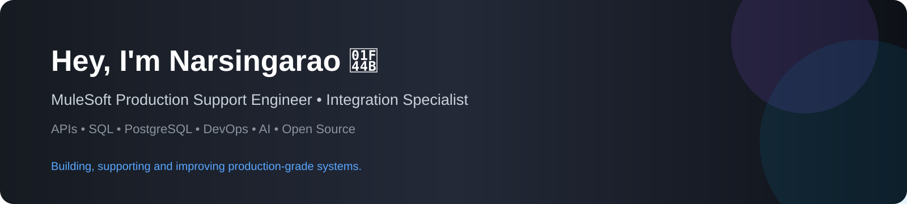

<h2>A little more about me... </h2>

  
  

## Featured Projects

<table>
  <tr>
    <td align="center">
      
    </td>
    <td align="center">
      
    </td>
  </tr>
  <tr>
    <td align="center">
      
    </td>
    <td align="center">
      
    </td>
  </tr>
  <tr>
    <td align="center">
      
    </td>
    <td align="center">
      
    </td>
  </tr>
</table>

  

  ---

  ####  <em><b>Thanks for stopping by — building reliable integrations, production systems and open-source tools. 👨🏻‍💻</b></em>

  

